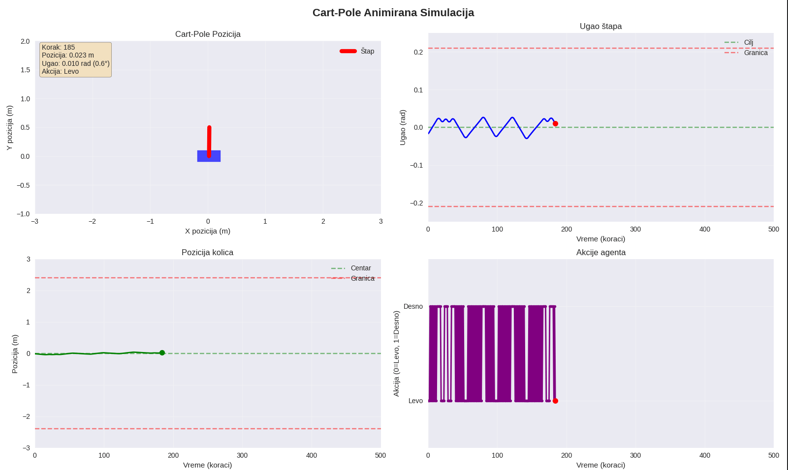

# CARTPOLE Q LEARNING



## Pokretanje
### Treniraj od nule
```bash
python main.py --train
```

### Treniraj sa podešenim brojom epizoda
```bash
python main.py --train --episodes 5000
```

### Učitaj model i nastavi da treniraš
```bash
python main.py --load result/cart_pole_model.pkl --train --episodes 1000
```

### Testiraj model
```bash
python main.py --load result/cart_pole_model.pkl --test
```

### Treniraj i odma testiraj
```bash
python main.py --train --test --episodes 2000
```

```
usage: main.py [-h] [--train] [--test] [--load LOAD] [--episodes EPISODES] [--save-path SAVE_PATH] [--test-episodes TEST_EPISODES] [--render] [--render_train]
               [--render_test]

Cart-Pole Q-Learning Agent

options:
  -h, --help            show this help message and exit
  --train               Train the agent
  --test                Test the agent
  --load LOAD           Load model from specified path (e.g., --load result/cart_pole_model.pkl)
  --episodes EPISODES   Number of training episodes (default: 3000)
  --save-path SAVE_PATH
                        Path to save the trained model (default: result/cart_pole_model.pkl)
  --test-episodes TEST_EPISODES
                        Number of test episodes (default: 10)
  --render              Render the environment (train + test)
  --render_train        Render the train environment
  --render_test         Render the test environment
```
